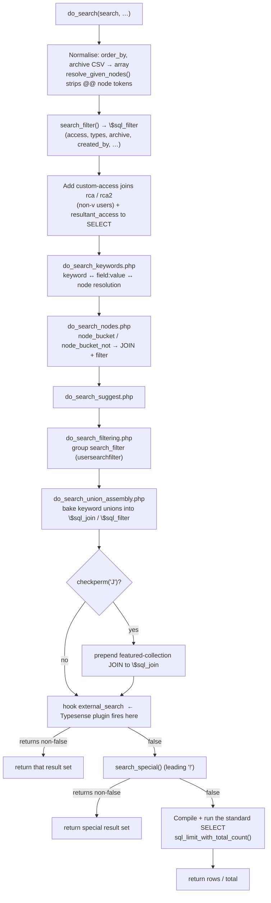

# ResourceSpace Search Behaviour

Reference documentation for how **core ResourceSpace** turns a search request into a set of
resources. This is the behaviour the `typesense_search` plugin has to reproduce (or deliberately
defer to core on), so it is written as a specification of *what core does today*, with the source
locations that define each rule.

All line references are to this checkout. The entry point is
[`do_search()`](../../../include/do_search.php:44); the filter/special/sort helpers live in
[`include/search_functions.php`](../../../include/search_functions.php); the pipeline stages are the
`do_search_*.php` includes.

---

## 1. Entry point

Every search — the search page, collection views, the API, smart collections, dependent lookups —
goes through one function:

```php
do_search(
    $search,                    // the search string (see §3)
    $restypes = '',             // CSV of resource_type refs to limit to ('' = all, 'Global…' = all)
    $order_by = 'relevance',    // sort key (see §9)
    $archive = '0',             // CSV of archive/workflow states to include
    $fetchrows = -1,            // result window (see §10)
    $sort = 'desc',             // sort direction
    $access_override = false,   // bypass access control (smart collections judge every resource)
    $starsearch = …,            // DEPRECATED, retained for signature compatibility
    $ignore_filters = false,
    $return_disk_usage = false, // wrap query to SUM(disk_usage) instead of returning rows
    $recent_search_daylimit = '',
    $go = false,                // paging direction hint
    $stats_logging = true,      // log keyword usage
    $return_refs_only = false,  // return [{ref}, …] instead of full rows
    $editable_only = false,     // restrict to resources the user can edit
    $returnsql = false,         // return the PreparedStatementQuery instead of executing
    $access = null,             // (v users only) restrict to a specific access level
    $smartsearch = false
)
```

**Return shape** depends on the flags (see §10): a flat padded array of rows, a
`['total'=>…, 'data'=>…]` structure, a `[{ref}]` list, a `PreparedStatementQuery`, a disk-usage
row, a suggested-search string when there were no matches, or `[]`.

---

## 2. The search pipeline

`do_search()` normalises its arguments and then runs a fixed sequence of stages. Each stage is a
separate `include` that can *short-circuit the whole search by returning early*
([do_search.php:297-316](../../../include/do_search.php:297)).



Key ordering facts the plugin depends on:

- **The `external_search` hook fires *before* `search_special()`**
  ([do_search.php:342](../../../include/do_search.php:342) vs
  [:382](../../../include/do_search.php:382)). So a provider sees *every* search — plain, special,
  node, field-scoped — and must return `false` for anything it will not serve, letting core
  continue.
- By the time the hook fires, `$sql_filter` and `$sql_join` **already carry the access joins, group
  filter, keyword unions and node buckets** baked in as SQL. External providers don't reuse that
  SQL — they re-derive the same restrictions from the structured args — but it means keyword and
  node matching apply to special searches too (they are joined into `$sql_join`/`$sql_filter`, then
  `search_special()` wraps its own scope around them).
- A resource ID typed on its own is handled two ways: with `$config_search_for_number` it becomes an
  exact `!resource`-style lookup; without it, core does a normal search but **boosts the exact ref
  match to the top** ([do_search.php:320](../../../include/do_search.php:320)).

---

## 3. Anatomy of the search string

A single `$search` string can carry several kinds of token at once. They are parsed and peeled off
in this order:

| Token form | Meaning | Where handled |
|---|---|---|
| `!command[args]` (leading `!`) | Special search (§8). `!empty…` is the exception — treated as a field search, not a special. | [do_search.php:125](../../../include/do_search.php:125), `search_special()` |
| `@@<node>` , `@@<node>@@<node>` | Node selection — OR within a token | `resolve_given_nodes()` → `$node_bucket` |
| `@@!<node>` | Node exclusion (NOT) | `resolve_given_nodes()` → `$node_bucket_not` |
| `fieldname:value` | Field-scoped search (§5) | `do_search_keywords.php` |
| `word` | Free-text keyword (§4) | `do_search_keywords.php` |
| `word*` | Wildcard / prefix | keyword step |
| `"two words"` | Quoted phrase | `split_keywords()` |
| `a;b` | OR group within one keyword | keyword step / `prepare_regex_search_string()` |
| `-word` | Exclude keyword (NOT) | keyword step |

Multiple `@@` node tokens form **AND groups of ORs**: each `@@`-word becomes one bucket in
`$node_bucket`, buckets are ANDed together, nodes inside a bucket are ORed
([do_search.php:519-541](../../../include/do_search.php:519)). Free keywords are combined with AND
(all must match) unless expanded (e.g. a wildcard expands to many nodes → any-of).

---

## 4. Keyword matching model

ResourceSpace does **not** do substring matching on a big text blob. Since v10, every indexable
value — fixed-list options *and* the words of text/date fields — is a row in `node`, and each
resource↔node link is a row in `resource_node`. Keyword matching is therefore a set of
**node/keyword joins**:

- A keyword resolves to the `keyword`/`node` rows it matches, and the resource must be linked to
  them. Each keyword becomes a "union" that must be satisfied
  ([do_search_union_assembly.php](../../../include/do_search_union_assembly.php)).
- **Multiple keywords are ANDed** — a resource must match all of them (subject to wildcard
  expansion, which turns one keyword into an any-of set).
- Only fields flagged for indexing (`keywords_index` / `partial_index`) contribute their words, and
  fields the user cannot see are excluded up front via `get_hidden_indexed_fields()`
  ([do_search.php:286](../../../include/do_search.php:286)).
- `metadata_field_view_access()` gates the *title* field too — a hidden title field is dropped from
  the SELECT/sort ([do_search.php:267](../../../include/do_search.php:267)).

Consequence: a keyword search is inherently **word-level and field-scoped at the index**, not
free-form `LIKE '%…%'`. This is why the Typesense side maps a keyword search onto `q` + `query_by`
over the same indexed fields, and why a bare-colon `field:value` filter (word-contains) reproduces
the same result set as a keyword search of that field.

---

## 5. Field searching (`fieldname:value`)

`do_search_keywords.php` inspects each `fieldname:value` token and branches on the **field type**
([do_search_keywords.php:86-265](../../../include/do_search_keywords.php:86)):

- **Fixed-list fields** (`$FIXED_LIST_FIELD_TYPES` =
  checkbox `2`, dropdown `3`, category tree `7`, dynamic keyword `9`, radio `12`): the value is
  resolved to matching **node refs**, which are pushed into `$node_bucket` as an OR group
  ([:251-265](../../../include/do_search_keywords.php:251)). From that point it is just a node
  search — the legacy `shortname:value` form and a UI `@@node` selection converge to the same thing.
  Category-tree searches also match descendants because ancestor nodes are stored on the resource at
  save time.
- **Text fields** (single/multi-line, formatted, warning): the value becomes a **keyword union
  scoped to that field** — word-level matching, honouring wildcards.
- **Date fields**: parsed as a date (or partial date / range), including special forms like
  `field:numrange1|1234` and date-range `start…end` handling
  ([:185-206](../../../include/do_search_keywords.php:185)).
- **`!empty<fieldref>` / `!emptyshortname`**: resources with *no* value in that field
  ([:310](../../../include/do_search_keywords.php:310)).
- A field the user cannot view is skipped (never probed).

So: **fixed-list `field:value` → node bucket; text/date `field:value` → field-scoped keyword/date
criteria.** The two paths are different at the SQL level even though they look identical to the
user.

---

## 6. Node buckets

After parsing, two structures drive node matching, applied by
[`do_search_nodes.php`](../../../include/do_search_nodes.php):

- `$node_bucket` — array of AND groups; within a group the nodes are ORed. Populated from `@@`
  selections *and* resolved fixed-list `field:value` tokens.
- `$node_bucket_not` — flat list of nodes to exclude from the whole search.

This is the mechanism the advanced search UI, category trees and related-field refine-within all
use. The Typesense equivalent is `nodes:=[…]` (per bucket, ANDed) and `nodes:!=[…]`.

---

## 7. Filtering and access control

Two layers run for (almost) every search: **`search_filter()`** builds the shared `WHERE` fragment,
and **`do_search()` itself** adds the custom-access joins. Both are keyed off the user's
permissions.

### 7.1 `search_filter()` — [search_functions.php:730](../../../include/search_functions.php:730)

Adds, in order, only the clauses that apply:

1. **Resource types** — `resource_type IN (restypes)`, *unless* `restypes` is blank, starts with
   `Global`, or the search is `!collection` ([:751](../../../include/search_functions.php:751)).
2. **Recent day limit** — `creation_date > curdate() - INTERVAL n DAY`.
3. **`resource_created_by_filter`** — restrict to given creators (`-1` = current user).
4. **`T<type>` permissions** — `resource_type NOT IN (…)` (hide whole types from this user).
5. **"Use" access** — non-`v` users never see access=2 (confidential) unless a custom-access grant
   (`rca`/`rca2`) says otherwise ([:815-821](../../../include/search_functions.php:815)).
6. **Archive / workflow states** ([:823-872](../../../include/search_functions.php:823)):
   - `!collection` / `!list` / `!archivepending` / `!userpending` → **any** archive state (these
     define their own state, or a collection may legitimately hold pending items). `!collection`
     still hides `archive=2` when `$collections_omit_archived` and no `e2` perm.
   - `$search_all_workflow_states`, `!related`, `!hasdata`, `integrityfail` → no default-state
     filter (a hook may add one).
   - otherwise → `get_default_search_states()` (config-driven, **not hardcoded to 0**), unless the
     advanced-search passed explicit `$archive` states.
   - Plus a blanket rule hiding pending (`archive=-2`/`-1`) resources from non-`v` users unless the
     user created them or has `ert<type>`.
7. **`z<state>` permissions + `$additional_archive_states`** — exclude states this user is blocked
   from ([:874-902](../../../include/search_functions.php:874)); `$uploader_view_override` lets a
   user still see their own.
8. **`heightmin`** media restriction.
9. **`r.ref > 0`** — always; never returns the negative-ref upload templates.
10. **`$access` exact-level filter** — only honoured for `v` users.
11. **`editable_only`** — a large extra block (`e<state>`, `ert`, `XE`/`XE-` type rules,
    `edit_access_for_contributor`) restricting to editable resources
    ([:928-1062](../../../include/search_functions.php:928)).

### 7.2 Custom access grants (`rca` / `rca2`) — [do_search.php:183](../../../include/do_search.php:183)

For non-`v`, non-override users, `do_search()` LEFT-JOINs `resource_custom_access` twice:

- **`rca`** — *group* grant: `usergroup = <group> AND access <> 2`. Group grants **do not expire**.
- **`rca2`** — *user* grant: `user = <userref> AND access <> 2 AND (user_expires IS NULL OR
  user_expires > now())`. User grants **can expire**.

The filter then enforces `NOT (rca.resource IS NULL AND r.access = 3)` — a **custom-access
(access=3)** resource is only visible when a grant row exists. Combined with the confidential rule
in `search_filter()`, this is the whole grant model:

| `r.access` | Meaning | Visible to non-`v` user when… |
|---|---|---|
| 0 | Open | always |
| 1 | Restricted | always (metadata visible; download gated elsewhere) |
| 2 | Confidential | only if a group/user grant with `access <> 2` exists |
| 3 | Custom | only if a matching grant row exists |

The SELECT also computes `resultant_access` (LEAST of resource + custom access, with `X<type>` and
`$userderestrictfilter` nuances) so downstream display logic knows the effective level without
re-querying ([do_search.php:216-262](../../../include/do_search.php:216)).

### 7.3 Group search filter (`usersearchfilter`) — [get_filter_sql()](../../../include/search_functions.php:1957)

A user group can carry a **search filter**: a set of node rules that silently constrain every search
for that group. Each rule has `nodes_on` (must be linked) and `nodes_off` (must not be), expressed
as `r.ref IN (SELECT resource FROM resource_node WHERE node IN (…))`. The rules are combined by the
filter condition:

- `RS_FILTER_ALL` → rules ANDed; `nodes_on`=IN, `nodes_off`=NOT IN.
- `RS_FILTER_NONE` → inverted (the "on"/"off" senses flip).
- `RS_FILTER_ANY` → rules ORed.

The whole filter is then OR'd with two escape hatches: a custom-access grant
(`$custom_access_overrides_search_filter`) and the user's own contributions
(`$open_access_for_contributor`). Applied in
[`do_search_filtering.php`](../../../include/do_search_filtering.php).

### 7.4 Featured-collections-only mode (`J` permission) — [do_search.php:325](../../../include/do_search.php:325)

When the user has `J`, results are restricted to resources that belong to a featured collection the
user may access — a JOIN to `collection_resource`/`collection` filtered by
`featured_collections_permissions_filter_sql()`. The user's own upload collection
(`!collection<-userref>`) is exempt so upload-then-edit still works.

---

## 8. Special searches (`!command`)

`search_special()` ([search_functions.php:1090](../../../include/search_functions.php:1090))
recognises a leading `!` and returns a result set directly (bypassing the standard SELECT). It runs
*after* the `external_search` hook, so a provider can serve or defer any of these. Node/keyword
criteria from earlier stages are already baked into `$sql_join`/`$sql_filter`, so most specials
combine with keywords (e.g. `!collection123 sunset`).

| Command | Behaviour | Notes / core SQL |
|---|---|---|
| `!last<n>` | Most-recent **n** resources | Inner `… ORDER BY ref DESC LIMIT n`; default `1000` if `n` invalid. A **result cap**, not a filter. |
| `!collection<id>` | Members of a collection | JOIN `collection_resource`; access-checked (owner/public/featured/request/research); default sort `c.sortorder`. |
| `!list<a:b:c>` / `!listall<…>` | Explicit ref list | `r.ref IN (…)`. `!listall` skips the default archive filter. |
| `!resource<ref>` / bare number* | Single resource by ref | *`$config_search_for_number` makes a bare integer behave as this. |
| `!contributions<userref>` | Resources created by a user | Own + `$open_access_for_contributor` bypasses custom-access joins and archive default. |
| `!hasdata<fieldref>` | Resources with any value in a field | `RIGHT JOIN resource_node … WHERE resource_type_field = ?`; result cached (slow). |
| `!archivepending` | `archive = 1` | Pending review. |
| `!userpending` | `archive = -1` | User-contributed pending; can order by `request_count`. |
| `!unused` | Not in any collection | `r.ref NOT IN (SELECT resource FROM collection_resource)`. |
| `!images` | `has_image > 0` | |
| `!nopreview` | `has_image = 0` | |
| `!integrityfail` | `integrity_fail = 1 AND no_file = 0` | File integrity problems. |
| `!locked` | `lock_user <> 0` | Locked resources. |
| `!related<ref>` | Related resources (both directions) | UNION over `resource_related`; optional self-row. |
| `!relatedpushed<ref>` | Related via push-metadata types | View-page variant. |
| `!geo<encoded>` | Bounding-box geo search | `geo_lat`/`geo_long` between; encoded to survive keyword splitting. |
| `!colour<val>` | Colour by `colour_key` prefix | `colour_key LIKE`. |
| `!colourkey<key>` | Colour by 4-char key | `LEFT(colour_key,4) = ?`, `has_image > 0`. |
| `!rgb:r,g,b` | Nearest colour | Orders by RGB distance; hard limit 500. |
| `!properties<n:v;…>` | Dimension / size / extension / orientation / creator | `hmin/hmax/wmin/wmax/fmin/fmax/fext/pi/cu/orientation`; joins `resource_dimensions`. |
| `!nodownloads` | No download activity | `NOT IN (SELECT … daily_stat …)`. |
| `!duplicates[<ref>]` | Duplicate files | Same `file_checksum`; `GROUP BY … HAVING count > 1` for the all-duplicates form. |
| `!noningested` | Not-yet-ingested files (admin only) | `checkperm('a')`; `file_path` set; **unfiltered** by access. |
| `!report<id>…` | A report rendered as results | Needs `t` perm; embeds the report's own SQL; date-range args. |
| `!empty<field>` | Resources with an empty field | Handled in the keyword stage, not here. |

Plugins can add their own via the **`addspecialsearch`** hook
([:1695](../../../include/search_functions.php:1695)).

**Refs-only / count reduction**: for `return_refs_only`, disk-usage or count queries,
`search_special()` strips the heavy display columns and `GROUP BY r.ref`
([:1702-1758](../../../include/search_functions.php:1702)).

---

## 9. Sort ordering

`set_search_order_by()` ([search_functions.php:3137](../../../include/search_functions.php:3137))
maps an `order_by` **key** to a SQL `ORDER BY` fragment. Every option ends in `r.ref` for a stable
tiebreak:

| Key | Sorts by |
|---|---|
| `relevance` (default) | `score, user_rating, total_hit_count, [date], ref` |
| `popularity` | `user_rating, total_hit_count, [date], ref` |
| `rating` | `r.rating, user_rating, score, ref` |
| `date` | date field then `ref` |
| `modified` | `modified, ref` |
| `colour` | `has_image, image_blue/green/red, [date], ref` |
| `title` | title field, `ref` |
| `resourceid` | `ref` |
| `resourcetype` | `order_by, resource_type, ref` |
| `status` | `archive, ref` |
| `extension`, `file_path`, `random` | as named (`random` = `RAND()`) |
| `country` / `titleandcountry` | only if default field 3 present |
| `collection` | `c.sortorder …` — only within `!collection` |
| `field<n>` | arbitrary metadata field; numeric/dot-notation aware |

Notes: the date field is only included when the user can view it; passing a raw SQL string that
isn't a known key falls back to `relevance` (or `collection` inside a collection search). This is
why an external provider must **veto** (fall back to MySQL) for sorts it can't reproduce on indexed
fields, rather than silently substituting relevance.

---

## 10. Result shapes (`fetchrows`, `return_refs_only`, `returnsql`, disk usage)

`fetchrows` controls the window and the **return format**
([do_search.php:418-477](../../../include/do_search.php:418)):

- **`-1`** (default) — all rows, returned as a **flat array padded with `0` entries** up to the true
  total (legacy behaviour so callers can page by index).
- **integer `n`** — first `n` rows, still padded to the total.
- **`[offset, limit]` array** — returns the structured `['total'=>…, 'data'=>[…]]` from
  `sql_limit_with_total_count()`, **not padded**. The main search-results grid uses this form.
- **`return_refs_only`** — returns `[{ref}, …]` (or the structured form for an array `fetchrows`).
- **`returnsql`** — returns the `PreparedStatementQuery` (SQL + params), executing nothing.
- **`return_disk_usage`** — wraps the query to return `SUM(disk_usage)` / counts instead of rows.

When there are **no matches**, a keyword search returns a **suggested search string** (keywords
removed, least-used first) rather than an empty array — unless the search was field-scoped or a
single keyword, in which case it returns `""`
([do_search.php:479-511](../../../include/do_search.php:479)).

> Plugin note: the `typesense_search` UI badge keys off this — the main grid uses an
> `[offset, limit]` array, so incidental scalar-`fetchrows` searches on the page (the selection
> bar, counts, refs lookups) are intentionally ignored when deciding which engine "served" the
> visible results.

---

## 11. Config options that change search results

These must be honoured or a re-implementation will diverge from core:

- **Index-time:** `$stemming`, `$partial_index_min_word_length`,
  `$resource_field_verbatim_keyword_regex` (tokenisation).
- **Keyword/number:** `$wildcard_always_applied` (force prefix, disable synonyms/quoted),
  `$config_search_for_number` (bare number → exact ref vs boosted).
- **Archive/workflow:** `get_default_search_states()`/`$searchstates`,
  `$search_all_workflow_states`, `$additional_archive_states`, `$resource_deletion_state`,
  `$archive_standard`.
- **Types on specials:** `$special_search_honors_restypes`.
- **Collections:** `$collections_omit_archived` (+`e2`), `$allow_smart_collections` /
  `$smart_collections_async` (a `!collection` on a smart collection triggers a rebuild side-effect),
  `$USER_SELECTION_COLLECTION`.
- **Access/contributor:** `$open_access_for_contributor`, `$custom_access_overrides_search_filter`,
  `$uploader_view_override`, `$edit_access_for_contributor`.
- **Sort:** `$default_sort`, `$default_sort_direction`, `$order_by_resource_id`, `$popularity_sort`,
  `$orderbyrating`, `$colour_sort`, `$random_sort`, `$category_tree_search_use_and_logic`.

---

## 12. Extension hooks

- **`external_search`** — the main override point ([do_search.php:342](../../../include/do_search.php:342)).
  Return a result set (even an empty one) to take over the search, or `false` to let core continue.
  Receives the structured args (`$search`, `$keywords`, `$node_bucket`, `$node_bucket_not`,
  `$restypes`, `$order_by`, `$archive`, `$fetchrows`, `$access_override`, `$return_refs_only`,
  `$editable_only`, `$returnsql`, `$access`, `$smartsearch`, plus the pre-built `$sql_filter`,
  `$sql_join`, `$select`).
- **`addspecialsearch`** — add a `!command` ([search_functions.php:1695](../../../include/search_functions.php:1695)).
- **`alternativeresults`**, **`modifyfetchrows`**, **`dosearchmodifykeywords`**,
  **`modifyselect`/`modifyselect2`**, **`search_pipeline_setup`**, **`modifyorderarray`**,
  **`modifycollectionsearchsql`**, **`beforereturnresults`**, **`zero_search_results`** — finer
  interception points around the pipeline.

---

## 13. Combination searches (verified against core)

A single search request routinely combines several of the criteria types above. The reason they
stack is structural: **every keyword, `field:value` and node token is resolved into either
`$node_bucket` or the keyword-union arrays, and both are baked into the shared `$sql_join` /
`$sql_filter` before `search_special()` and the `external_search` hook run**
([do_search_union_assembly.php:38-76](../../../include/do_search_union_assembly.php:38),
[do_search_nodes.php:8-35](../../../include/do_search_nodes.php:8), then
[do_search.php:382](../../../include/do_search.php:382)). So a special search *wraps* the keyword +
node criteria rather than replacing them. `restypes`, `archive` and `access` arrive as separate
arguments and are ANDed in by `search_filter()`.

Each combination below was confirmed by tracing the code path, not assumed. The **Typesense
plugin** column records what the `typesense_search` plugin does with the same combination today
(verified against the code, and live where noted), using these markers:

- ✅ **served** — the plugin answers it via Typesense, matching core.
- ↩️ **core** — the plugin vetoes and lets core MySQL answer. Correct results, just not
  Typesense-accelerated — and returns an **empty** set instead when `$typesense_search_only` is on.
- ⚠️ **wrong** — the plugin answers via Typesense but *incorrectly*, with **no** fallback (the
  dangerous case: silent wrong/empty results).
- ≈ **partial** — passed to Typesense, but the exact semantics aren't guaranteed/validated.

### 13.1 Support matrix

| Combination | Core | How it stacks in core (verified) | Typesense plugin |
|---|---|---|---|
| keyword **+** keyword | ✅ | Each keyword is a union; criteria ANDed ([union_assembly:55-74](../../../include/do_search_union_assembly.php:55)). | ✅ served — one `q`, AND via `drop_tokens_threshold=0` |
| keyword **OR** keyword — `red;green` | ✅ | `explode(';')` sets `union_or` → ORed group ([keywords:301](../../../include/do_search_keywords.php:301)). Fixed-list too ([:258](../../../include/do_search_keywords.php:258)). | ↩️ core — **vetoed** (`typesense_build_q_from_keywords`): Typesense has no term-level OR across `query_by`, so core ORs it correctly |
| keyword **NOT** — `-word` | ✅ | `omit` flag → excluded from the union ([keywords:305](../../../include/do_search_keywords.php:305)). | ✅ served — Typesense honours `-word` (minor stemming difference vs core's exact word) |
| quoted phrase — `"red car"` | ✅ | `split_keywords()` keeps the phrase intact. | ≈ partial — quotes passed into `q`; phrase adjacency not separately validated |
| full-text boolean phrase | ✅ | `MATCH(name) AGAINST(… IN BOOLEAN MODE)` union ([keywords:29-49](../../../include/do_search_keywords.php:29)). | ↩️ core — **vetoed** (`@FULL_TEXT…` detected): no boolean-mode equivalent in Typesense |
| keyword **+** node select `@@n` | ✅ | Node JOIN in `$sql_join`; keyword union ANDed alongside. | ✅ served — `q` + `nodes:=[…]` |
| keyword **+** fixed-list `field:value` | ✅ | Fixed-list value → `$node_bucket` ([keywords:247-268](../../../include/do_search_keywords.php:247)); ANDed with the keyword. | ✅ served — core pre-resolves to `$node_bucket` → `nodes:=[…]` |
| multiple node buckets (AND of ORs) | ✅ | One JOIN per bucket, ANDed; `IN(…)` = OR within ([nodes:8-22](../../../include/do_search_nodes.php:8)). | ✅ served — one `nodes:=[…]` clause per bucket, ANDed |
| node select **+** node exclude `@@!n` | ✅ | Exclusion → `NOT EXISTS (…)` prefixed to the filter ([nodes:31-35](../../../include/do_search_nodes.php:31)). | ✅ served — `nodes:!=[…]` |
| keyword **+** text `field:value` | ✅ | Field-scoped keyword (`search_field_restrict`) ([keywords:291-294](../../../include/do_search_keywords.php:291)). | ✅ served — bare-colon `field_<ref>_s`/`_text` filter + free-text `q` |
| multiple `field:value` (mixed field types) | ✅ | Fixed-list → node bucket, text/date → union; all ANDed. | ✅ served — each becomes a node clause or a `field_*` filter, ANDed |
| date `field:value` / range / `numrange` | ✅ | Dedicated date/number JOINs ([keywords:128-246](../../../include/do_search_keywords.php:128)). | ✅ served — plain value (`field_<ref>_q`) **and date range** as an interval overlap on `field_<ref>_range_start`/`_range_end` (via `typesense_parse_date`), for **all** date field types incl. DATE_RANGE. Numeric `numrange` ✅ served on `field_<ref>_f` (single bound = exact match, mirroring core), for numeric-constrained (`field_constraint==1`) indexed fields |
| any search **+** `restypes` argument | ✅ | `resource_type IN (…)` — **except `!collection`, which ignores restypes** ([search_functions:751](../../../include/search_functions.php:751)). | ✅ served — `resource_type:=[…]`; `!collection` skip honoured ([restrictions/standard.php:42](../include/restrictions/standard.php)) |
| any search **+** `archive` states argument | ✅ | Advanced search passes explicit states ([search_functions:846-853](../../../include/search_functions.php:846)). | ✅ served — `archive:=[…]` |
| special **+** keyword — `!collection123 sunset` | ✅ | Keyword union already in `$sql_filter`; the special's SQL includes `AND (… filter …)`. | ✅ served — mode scope + shared keyword step compose |
| special **+** node / fixed-list refine — `!collection123 country:france` | ✅ | Node JOIN already in `$sql_join`, carried into the special's query. | ✅ served — mode scope + `nodes:=[…]` |
| special **+** text `field:value` — `!collection123 caption:report` | ✅ | The field-scoped union is in `$sql_join`/`$sql_filter`. | ✅ served — the bare-colon field filter composes with the mode *(previously deferred; now implemented)* |
| `!list1:2:3` **+** keyword | ✅ | `r.ref IN (…) AND (sql_filter)` where the filter holds the keyword union. | ✅ served — `ref:=[…]` + `q` |
| `!last50` **+** keyword | ✅ | Inner `… WHERE sql_filter ORDER BY ref DESC LIMIT 50` — caps the *matched* set, not the whole table. | ✅ served — recent-N cutoff + `q`, then your sort ([modes/last.php](../include/modes/last.php)) |
| `!properties` multi-property — `!propertieshmin:100;fext:jpg` | ✅ | `;`-separated, each ANDed ([search_functions:1502-1596](../../../include/search_functions.php:1502)). | ↩️ core — no `!properties` mode → `UnsupportedSpecialMode` vetoes |
| `!properties…` **+** keyword (space-separated) | ✅ | Explicitly designed to combine — first space-token is the property list, the rest are keywords. | ↩️ core — vetoes with the special |
| special **+** special — `!collection123 !last50` | ❌ | Only the **first** matching `!` branch runs; the second is left as stray keyword text. Not a real combination. | ↩️ core-equivalent — plugin also honours only the first special |
| `field:value` on a **non-viewable** field | ⚠️ aborts | Returns `false` for the *whole* search, not just that clause ([keywords:121-124](../../../include/do_search_keywords.php:121)). | ↩️ core — plugin vetoes (won't probe hidden data); core then aborts |
| `-field:value` (negate a fixed-list field) | ⚠️ degrades | `-country` isn't a field name, so it splits into loose keywords `-country` / `france` rather than a field-scoped exclusion. Use `@@!<node>` for a true node exclusion. | ↩️ core — plugin vetoes `negative field-scoped search`; core degrades as noted |

### 13.2 Stacking rules (the mental model)

1. **Keywords AND by default**, OR only within a `;` group or a wildcard expansion; `-` negates.
2. **Node buckets AND across, OR within**; `@@!` excludes.
3. **`field:value` picks a lane by field type** — fixed-list → node bucket, text/date → scoped
   keyword/date criteria — then joins the shared filter like any other criterion.
4. **A special search adds a scope on top of all of the above**, because keyword + node SQL is
   already assembled when `search_special()` runs. Exactly **one** special per search.
5. **`restypes` / `archive` / `access` are arguments, not string tokens** — they AND in through
   `search_filter()` (with the documented `!collection` restypes exception).
6. **Access, group filter and `J` scoping always apply on top**, whatever the combination.

### 13.3 What does *not* combine

- **Two specials in one search.** `search_special()` is an if/elseif chain — the first match wins.
- **A hidden field in a `field:value`** aborts the search rather than being ignored (§13.1).
- **`restypes` with `!collection`** is silently dropped; filter by adding a resource-type *keyword*
  or node instead if you need to narrow a collection view by type.

### 13.4 Typesense plugin coverage — where it diverges from core

Most combinations are served by Typesense (the ✅ rows above). The remaining divergences all now
**fall back to core cleanly** (correct results via MySQL) — there are no known silent-wrong cases.

**🟡 Vetoes to core** — correct results via MySQL, just not Typesense-served (and **empty** under
`$typesense_search_only`):
- **OR-groups (`red;green`)** — Typesense has no term-level OR across `query_by` in one query, so
  `typesense_build_q_from_keywords` vetoes (both free-text `red;green` and field `caption:red;green`).
  Approximations (a giant per-field `filter_by` OR, or a `multi_search` union) lose relevance
  ranking / break pagination, so core is left to OR them.
- **Full-text boolean phrase** (`@FULL_TEXT…`) — no `MATCH … IN BOOLEAN MODE` equivalent; vetoed.
- **`!properties…`** (alone, multi-property, or with a keyword) — no `!properties` mode.
- **`-field:value`** and **`field:value` on a non-viewable field** — deliberate vetoes.
- Beyond the combination matrix, every special without a dedicated mode also vetoes here:
  `!images`, `!nopreview`, `!geo`, `!colour`/`!colourkey`, `!rgb`, `!related`/`!relatedpushed`,
  `!duplicates`, `!nodownloads`, `!integrityfail`, `!locked`, `!noningested`, `!report`, `!unused`
  (see the `UnsupportedSpecialMode` catch-all).

**🟠 Partial / unvalidated** — **quoted phrases** are passed to `q` but phrase adjacency isn't
guaranteed (may behave as "all words, any order").

**Served correctly** — everything else in §13.1: keyword AND, `-word` NOT, node select/exclude,
fixed-list and text `field:value`, multiple mixed `field:value`, restypes/archive arguments, every
`special + keyword / node / text-field` combination (`!list`+keyword, `!last`+keyword — which also
re-sort correctly), and **date-range `field:value`** for **all** date field types (including
DATE_RANGE). A range search is an **interval overlap** of the resource's indexed
`[field_<ref>_range_start, _range_end)` against the query window (both built via
`typesense_parse_date`, so boundaries align with the index). Because a partial date is itself an
interval (a year → the whole year, a month → the whole month), a resource dated "2020" correctly
matches a "June–August 2020" query — verified live (Jun–Aug 2020: overlap 640 vs a start-only
point test's 534). **Numeric `numrange`** searches are likewise served as `field_<ref>_f` range
filters (both bounds → `[min..max]`; a single bound → an exact match, mirroring core). Verified
live on a numeric test field (ref 170, values −50…1234 incl. a decimal, zero and a duplicate):
8/8 range/exact/negative/zero cases return exactly the expected resources, and numrange composes
correctly with a keyword, `ref` sort (both directions), a resource-type restriction and `!last`.

> **Indexing note:** numeric range/sort relies on `field_<ref>_f`, which is populated for
> **numeric-constrained** single-line fields (`field_constraint == 1`)
> ([typesense_search_functions.php:1025](../include/typesense_search_functions.php:1025)). A dataset
> with no such field simply has no `_f` values, so a `numrange` there matches nothing (Typesense
> returns 0 under `validate_field_names=0`, rather than erroring). *(This was previously a bug —
> the check read `$value == 1` instead of the field's numeric flag — now fixed; a reindex populates
> `_f`.)*

---

## 14. Worked use cases

Concrete requests and the behaviour they produce.

### 14.1 Plain keyword search — `sunset beach`
Two keywords, ANDed. Each resolves to node/keyword matches over the user's visible indexed fields.
`search_filter()` adds default archive states + access rules; `rca`/`rca2` joins hide confidential
resources without a grant. Sort = relevance. No match → a suggested search (`sunset` or `beach`).

### 14.2 Wildcard — `lond*`
The keyword expands to every node/keyword beginning `lond` (London, Londonderry, …); the resource
must match **any** of them (the union becomes any-of). With `$wildcard_always_applied`, *every* plain
keyword is treated this way and synonyms/quoted phrases are disabled.

### 14.3 Fixed-list field — `country:france` (dropdown field)
Resolved in the keyword stage to the node ref(s) for "France" and pushed into `$node_bucket`. From
there it's a pure node search — identical to clicking France in the advanced-search UI (`@@<node>`).

### 14.4 Text field — `caption:report`
`caption` is a text field, so this becomes a **field-scoped keyword** match (word-level, honouring
`report*` wildcards) — *not* a node bucket. Mixed `caption:report sunset` = field filter on caption
plus a free keyword `sunset`.

### 14.5 Advanced search — country France OR Spain, AND theme Nature, NOT archived
UI emits node tokens: `@@<fr>@@<es>` (one bucket, OR) and `@@<nature>` (second bucket). Buckets are
ANDed. An excluded value becomes `@@!<node>` → `$node_bucket_not`. Archive state comes from the
`$archive` argument, not the string.

### 14.6 Collection view — `!collection842`
`search_special()` verifies the user may see collection 842 (owner / public / featured / request /
research lists), joins `collection_resource`, returns members in `sortorder`. Archive filter relaxed
(any state) so pending items in the collection still appear; `$collections_omit_archived` + no `e2`
still hides `archive=2`. Add a term — `!collection842 sunset` — and the keyword union is ANDed in.

### 14.7 "Latest additions" widget — `!last50`
Returns the 50 most-recently-added resources (`ORDER BY ref DESC LIMIT 50`), reported total capped
at 50. It's a **cap**, not a filter, so an external engine must express it as a result limit + ref
sort.

### 14.8 Restricted contributor with `J` — searches `nature`
`J` adds the featured-collection JOIN, so results are limited to featured collections the user may
access (their own upload collection excepted). The group `search_filter` node rules and the
`rca`/`rca2` grants still apply on top. This is three restriction layers stacking on one keyword
search.

### 14.9 Confidential resource, granted user vs not
Resource has `access = 2`. A non-`v` user with **no** grant: hidden (`r.access <> 2` fails, no `rca`
row). A user in a group with a group grant (`rca.access <> 2`): visible. A user with a personal
grant whose `user_expires` has passed: hidden again (the `rca2` join requires `user_expires > now()`
live at query time).

### 14.10 Editable-only picker — `do_search('cat', …, editable_only: true)`
Adds the large editable filter block: `e<state>` edit-state permissions, `ert<type>` pending
exceptions, `XE`/`XE-` allowed/blocked types, `edit_access_for_contributor` for own resources — on
top of the normal filters.

### 14.11 Bare number — `4821`
With `$config_search_for_number = true`: treated as `!resource4821` (exact ref). With it `false`
(default): a normal keyword search, but resource 4821 is boosted to the first result if it matches
the filters.

### 14.12 Housekeeping — `!hasdata12`, `!unused`, `!duplicates`, `!integrityfail`
Admin-oriented specials: resources with any value in field 12; resources in no collection; files
sharing a checksum; resources flagged with integrity problems. Several bypass the normal
default-archive filter because they define their own scope.

### 14.13 Combination — `caption:report country:france sunset -draft`
Four criteria in one string, all ANDed: a text field-scoped keyword (`report` in caption, → keyword
union), a fixed-list field (`france` → node bucket), a free keyword (`sunset` → union) and an
exclusion (`-draft` → omitted union). Core assembles the two unions and the node JOIN into one query
([union_assembly](../../../include/do_search_union_assembly.php:38),
[nodes](../../../include/do_search_nodes.php:8)); access/archive filters apply on top. A resource
must satisfy every clause. *(The Typesense plugin serves the fixed-list + free-keyword + exclusion
parts and vetoes to core when a text `field:value` is present.)*

### 14.14 Combination — `!collection842 country:france sunset` (special + node + keyword)
A collection view refined to French resources matching "sunset". `country:france` → node bucket
(JOIN in `$sql_join`), `sunset` → keyword union (criteria in `$sql_filter`); both are already
assembled when `search_special()` builds the `!collection` query, so its SQL becomes
`… JOIN collection_resource … JOIN resource_node … WHERE c.collection=842 AND (keyword criteria)`.
This is the everyday "search within a collection" behaviour and is fully supported by core.

### 14.15 Combination — `!propertieswmin:1000;fext:jpg landscape` (special multi-arg + keyword)
`!properties` parses its own `;`-separated list (`wmin:1000` AND `fext:jpg`), and the space-separated
trailing token `landscape` is treated as a normal keyword union — the special was explicitly built to
combine with keywords. Result: JPG images at least 1000px wide whose metadata matches "landscape".

### 14.16 Not a combination — `!collection842 !last50`
Only `!collection` runs (first matching branch); `!last50` is left as stray text and quietly ignored
as a search term. To get "the 50 most recent in collection 842" you would sort the collection by date
and page, not chain two specials.

---

## 15. Summary for re-implementers

To reproduce a given search faithfully you need, in order: the **parsed intent** (special command,
field:value split by field type, node buckets, keywords, wildcard, sort key), the **shared
restrictions** (resource types, archive/workflow states from config not constants, `created_by`,
day limit, `z`/`T` permissions), and the **access model** (non-`v` confidential/custom rules via
live `rca`/`rca2` grants, the group `search_filter` node rules, and `J` featured-collection
scoping). Anything you cannot express — colour-distance sort, report SQL, duplicate grouping,
unindexed sort fields — should **fall back to core** rather than approximate it.
