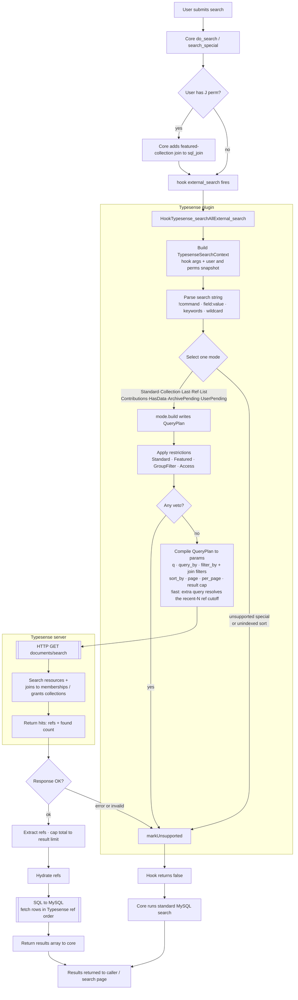

# Typesense Search — Extensible Query-Build Architecture

## Context

The `typesense_search` plugin translates an RS search into a Typesense query. Today that
translation is a single monolithic function, [`typesense_search_get_refs()`](../../../plugins/typesense_search/include/typesense_search_functions.php:106),
which inlines pagination, `filter_by`, wildcard/prefix, sort mapping, `query_by`, param
assembly, the HTTP call and ref extraction. The data needed for richer searches (node buckets,
access context, special `!` commands, `field:value`, collection joins) isn't even passed in,
and the gate [`typesense_search_supported()`](../../../plugins/typesense_search/include/typesense_search_functions.php:17)
is a flat list of `return false`s. Adding a search type currently means editing several functions.

**Goal (this plan):** restructure the query-build side into a clear, extensible pipeline so a
new search type = adding one small unit and registering it, orchestrator untouched. It must
handle three cases that exercise capabilities beyond plain filtering:
- **Collection searches** (`!collection<id>`) — a join to the memberships collection + collection sort order.
- **`!last<num>`** — a cap on the number of results (most-recent N), not a filter.
- **Featured-collections-only mode** (`J` permission) — an always-on restriction joining memberships to the user's accessible featured collections.

Incremental indexing/sync and the full internals of every remaining `!` search are **out of scope
here**; this plan establishes the framework, migrates existing behaviour, and proves it with the
three cases above. `field:value` searches on non-fixed-list fields are **in scope** — see the
dedicated section below.

## Status (23 Sep 2026)

The pipeline below is built and serving searches. Changes since this plan was written:
- **Sorting in `!last` and `!collection`** — both modes forced their own order (`ref:desc`,
  `sortorder:asc`), so the sort dropdown did nothing on the home/recent view (`!last<n>`) or inside a
  collection. Both now honour an explicit sort — see the modes below. **[FIXED]**
- **Range `field:value`** — date ranges (interval overlap on `_range_start`/`_range_end`, every date
  field type) and numeric `numrange` (on `_f`) are now served. **[BUILT]**
- **OR-groups (`red;green`) and full-text boolean searches** — now veto to core instead of being
  answered wrongly (Typesense has no equivalent). **[FIXED]**
- **Numeric indexing** — `_f` was almost never written (a `$value == 1` bug). **[FIXED]**
- **Incremental (on-save) indexing is broken** — RS edits only reach Typesense via a full reindex.
  **[OPEN]** — see *Indexing gaps*; tracked as a separate task.
- **Next: automated parity testing via the RS API** — run the same searches as a Typesense user and a
  MySQL-only user and diff the results. **[PLANNED]** — see *Verification*.

How each search combination behaves in Typesense versus core is documented in the companion
[search behaviour doc](../../../plugins/typesense_search/docs/resourcespace-search-behaviour.md) (§13).

## Target architecture

```
RS hook args ─► [Context] ─► [Parse] ─► [Mode] ─► [Restrictions] ─► [Compile] ─► [Execute] ─► [Hydrate]
                                          └────── the two extensible axes ──────┘
```

The design mirrors RS's own split: one **mode** decides the query shape (RS `search_special()`
vs standard), and **restrictions** layer visibility/scope on top of any mode (RS `search_filter()`).
Everything else is fixed pipeline plumbing, not an extension point.

### End-to-end flow



### Fixed plumbing (not components)
`Context` (normalize all hook args + user/permission snapshot), `Parse` (decompose the search
string once — leading `!command`+args, `field:value`, quoted phrases, keywords, trailing `*`),
pagination, sort mapping, `$typesense_search_global_filter` append, `Compile`, `Execute`,
[`Hydrate`](../../../plugins/typesense_search/include/typesense_search_functions.php:506). These always
run identically, so they live in the pipeline, not the registry.

### `TypesenseQueryPlan` (accumulator)
What modes/restrictions write into, compiled to Typesense params:
- `q`, `query_by` (field ⇒ weight), `num_typos`, `prefix`
- **`filter` tree** — groups `{connector: AND|OR, clauses[]}` → correctly parenthesised `filter_by`.
- **Reference-collection join filters** — `addJoinFilter(collection, expr)` (memberships and
  grants). First-class: `!collection`, `J`-mode and the access restriction need it. (Absence-of-match
  for `!unused` was planned but not built — `!unused` still vetoes.)
- **Recent-N selection** — `setRecentSelection(n)` for `!last<num>`: `execute` first resolves the
  Nth-highest ref among the matches (one extra query, reusing the plan's filters) and adds
  `ref:>=<cutoff>`, so the result set is the newest N while the display order is still the user's
  chosen sort — mirroring core's inner `ORDER BY ref DESC LIMIT n` + outer `ORDER BY`. It also sets
  the result cap.
- **Result cap** — `setResultLimit(n)` (report `total = min(found, n)`).
- **Restriction suppression** — `suppressRestriction(name)` so a mode can opt out of a
  standard restriction, mirroring core: `!collection`/`!list`/`!archivepending`/`!userpending`
  skip default archive states; `!contributions` bypasses custom-access for own resources.
  Restrictions are mode-aware and honour these flags.
- `sort_by`, `page`, `per_page`, target collection
- `supported` + `fallback_reason` — any unit may veto → MySQL fallback.

### Shared step — keyword matching + node buckets (runs for every mode)
`typesense_apply_keyword_matching()` is run by the orchestrator after any mode's `build()`,
because in core the keyword match and node buckets apply to *all* searches (baked into
`$sql_join`/`$sql_filter` before the hook). It builds `q` from `$keywords` with the field-token
split (fixed-list `field:value` is already in `$node_bucket` → dropped; **other `field:value` →
handled per the field:value section below**; negative field search → veto; **OR-groups
(`red;green`, or `caption:red;green`) → veto**, as Typesense has no term-level OR across `query_by`;
**full-text boolean (`"@FULL_TEXT…"`) → veto**; incidental colon → free text), sets `query_by` (wraps
[`typesense_build_query_by()`](../../../plugins/typesense_search/include/typesense_search_functions.php:186),
title gated on `metadata_field_view_access`), and translates `node_bucket`/`node_bucket_not` →
`nodes:=`/`nodes:!=`. So a special search's scope and keyword/node matching combine automatically.

### `field:value` searches (non-fixed-list fields) — [BUILT]
Fixed-list `field:value` is pre-resolved by core into `$node_bucket` (handled). This covers the
rest — text and date named searches (`caption:report`, `eventdate:2024`). The shared step resolves
each `shortname` to its field (via [`typesense_search_field_by_shortname()`](../../../plugins/typesense_search/include/typesense_search_query.php)),
**gated on `metadata_field_view_access`** (a non-viewable field → veto → MySQL, never probe hidden
data), removes the token from the free-text `q`, and via `typesense_search_fieldvalue_filter()`
adds a **`filter_by`** clause by field type. No reindex is needed — it uses the fields already
indexed.

Key finding (live-validated): the **bare-colon** operator (`field:value`, without `=`) is
Typesense's *non-exact, tokenised word-contains* filter on a string field, honouring that field's
tokenizer/stemming — it returns exactly what a keyword search of that field returns (`title:Gallery`
→ 1,982, identical to `q=Gallery, query_by=title`). This mirrors RS's own word-level, field-scoped
`node_keyword` match, so:
- **Text (multiline)** → `field_<ref>_text:<value>` (bare-colon word-contains).
- **Text (single-line / warning)** → `field_<ref>_s:<value>`.
- **Date fields** → `field_<ref>_q:<value>` (bare-colon over the representation array — matches
  partial dates like `2024`, `2024-02`).
- **Date ranges** (`eventdate:rangestart<A>end<B>`, as the advanced search builds them) → an
  **interval overlap** of the resource's `[field_<ref>_range_start, _range_end)` with the query
  window: `_range_end:>A.start && _range_start:<B.end`. `_range_*` is the date *at its own
  precision* (a year or month is an interval, a full date is one day, a DATE_RANGE field is its
  span), so it works for every date field type and a partial date like "2020" matches a June–August
  2020 query. Both bounds come from `typesense_parse_date()`, so they align with the index. **[BUILT]**
- **Numeric ranges** (`field:numrange<min>|<max>`, `neg` = minus) → `field_<ref>_f:[min..max]`; a
  single bound is an exact `:=` match, mirroring core's `rnn.name = max(min,max)`. **[BUILT]**
- **Wildcard** (`caption:report*`) → `field_<ref>_text:report*` (prefix on the word — validated).
- **Multi-word** → AND of the words; values with spaces/punctuation are backtick-quoted.

Because every case is a `filter_by` clause, `field:value` composes with keyword `q`, node buckets,
special modes and restrictions with no extra machinery (mixed `caption:report sunset` →
`filter_by field_caption_text:report` + `q=sunset`). Multiple `field:value` → multiple ANDed clauses.
Consequence for the schema: **no `_q` for text fields is needed** — `_text`/`_s` do double duty
(general `query_by` search *and* `field:value` via bare colon); `_q` stays only for date/number
representations. Numeric-constrained single-line fields (`field_constraint == 1`) are indexed as
`_f` + `_q` rather than `_s` (see *Indexing gaps*).

### Extension axis 1 — Search modes (mutually exclusive; parser selects one)
Contract: `applies(ctx): bool`, `build(ctx, plan): void`. Exactly one mode claims the search; each
adds only its own scope (filters/sort/cap/joins) — keyword matching is the shared step above.
- `StandardSearchMode` — no special scope (a marker mode); the shared step does the keyword work.
- `CollectionMode` — `!collection<id>`: `addJoinFilter(memberships, collection_ref:=<id>)`; keeps
  the collection-access validity checks/veto from the
  [`typesense_collection_search()`](../../../plugins/typesense_search/include/typesense_search_functions.php:407) stub.
  Orders by membership `sortorder` (honouring the direction) **only when the collection is using its
  default order** (a `c.sortorder…` `order_by`); any explicit sort (resource ID, date, modified,
  relevance) is left to the standard sort mapping, mirroring core's outer re-sort of the members.
  **[FIXED — it used to force `sortorder:asc`, so the sort dropdown did nothing in a collection]**
- `LastMode` — `!last<num>`: `setRecentSelection(N)` (default 1000) — the newest N by ref, shown in
  the user's chosen sort; it sets no sort of its own. **[FIXED — it used to force `ref:desc`, so the
  sort dropdown did nothing on the home/recent view]**
- `UnsupportedSpecialMode` — recognises any `!command` no other mode claims (buckets B and C below,
  plus `!unused`) and vetoes → MySQL fallback.

The full `search_special()` audit (below) confirms every special search lands in a mode.

**A. Built (data already indexed):** `!collection`, `!last`, `!list`/`!listall`
(`ref:=[...]`), `!resource`/numeric (`ref:=`), `!contributions` (`created_by:=`), `!hasdata`
(`populated_field_ids:=`), `!archivepending`/`!userpending` (`archive:=`). Keyword + node-bucket
matching is the shared step, so it combines with any of these (e.g. `!collection123 sunset`).
`!unused` (memberships absence-of-match) was planned here but **not built** — it currently vetoes
to core along with buckets B and C.

**B. Modes registerable once a small schema field is added (no framework change):** `!images`/
`!nopreview` (`has_image`), `!geo` (geo fields), `!colour`/`!colourkey` (`colour_key`),
`!properties` (dimensions/`file_size`/`file_extension`), `!integrityfail`/`!locked`/
`!noningested` (flags), `!related`/`!relatedpushed` (`related[]`).

**C. Genuine MySQL fallback (Typesense can't/shouldn't):** `!rgb` (computed colour-distance
sort), `!duplicates` (`GROUP BY … HAVING count>1`), `!nodownloads` (activity set), `!report`
(arbitrary report SQL). Handled by `UnsupportedSpecialMode` veto.

### Extension axis 2 — Restrictions (all apply, under every mode)
Same contract; each adds visibility/scope clauses regardless of mode.
- `StandardRestrictions` — migrates [`typesense_search_filter_by()`](../../../plugins/typesense_search/include/typesense_search_functions.php:374)
  and the rest of RS `search_filter()`: resource type (restypes + `T` perm), archive
  (defaults/advanced + `z` perms), `created_by`, `recent_search_daylimit`, `ert` pending rules.
- `FeaturedCollectionsRestriction` — when `checkperm("J")` and the search isn't the user's
  upload collection: `addJoinFilter(memberships, collection_ref:=[accessible FC refs])`,
  ref set from the [`featured_collections_permissions_filter_sql()`](../../../include/do_search.php:329)
  logic (extracted into a reusable helper).
- `GroupFilterRestriction` — reproduces the group `search_filter`
  ([get_filter_sql()](../../../include/search_functions.php:1957)) as node filters from
  `get_filter()`/`get_filter_rules()`: per-rule nodes_on/off → `nodes:=`/`nodes:!=` (inverted for
  NONE), rules glued by AND (ALL/NONE) or OR (ANY), the whole thing OR'd with a grant-exists clause
  (`$custom_access_overrides_search_filter`) and `created_by` (`$open_access_for_contributor`).
  Works against the existing `nodes[]` index — no schema change. **[BUILT]**
- `AccessRestriction` (Option A grants) — for non-`v` non-override users:
  `access:!=2 || $grants((user:=U && (expires:=0 || expires:>now)) || usergroup:=G)` and
  `access:!=3 || $grants(usergroup:=G)`. Group grants never expire (mirrors the `rca` join); the
  `g`-perm resultant_access is display logic, not here. Needs the `access` field + grants
  collection (both added to `ensure_collection`) and grant indexing (`typesense_search_reindex_grants`,
  a reindex pass, and `typesense_search_index_grants()` for future incremental sync).
  **[BUILT — live-validated: granted user sees confidential/custom, ungranted user does not]**

### Registry + orchestrator
- `typesense_search_modes()` / `typesense_search_restrictions()` return ordered lists, each
  extensible via a hook (e.g. `hook('typesense_register_search_modes')`) so a new type — or
  another plugin — registers without editing the orchestrator.
- `typesense_search_build_query($ctx)` — pick the one applicable mode → `build`; then run every
  restriction → `build`; if anything vetoes, return null → hook returns `false`.
- `typesense_search_execute($plan)` — compile params (assemble `filter_by`, join filters,
  `sort_by`, apply result cap), HTTP GET via [`typesense_search_request()`](../../../plugins/typesense_search/include/typesense_search_functions.php:600), extract refs + capped total.
- `typesense_search_do_search()` = thin driver: context → parse → build → execute → hydrate.

## What changes in code
- **New** `include/typesense_search_query.php` — Context, Parse, QueryPlan (incl. join-filter +
  result-cap compilation), mode/restriction contract, registries, orchestrator, execute.
- **New** `include/modes/` + `include/restrictions/` — one file per unit (Standard + Collection +
  Last modes; Standard + FeaturedCollections restrictions).
- **Refactor** `typesense_search_get_refs()` → `typesense_search_execute()`; retire
  `typesense_search_filter_by()`, `typesense_search_supported()`, inline sort/pagination and the
  `typesense_parse_search()`/`typesense_collection_search()` stubs into the pipeline/units.
- **Hook** [`HookTypesense_searchAllExternal_search`](../../../plugins/typesense_search/hooks/all.php:35) builds the context and calls the driver.
- **Small core helper** — extract the accessible-featured-collection ref list for the `J` restriction.

## Config dependencies (must be honoured or Typesense diverges from MySQL)
Each unit reads the relevant `config.default.php` options; several are current divergence risks:
- **Index-time (⚠):** `$stemming` — schema currently stems `title`/`text` **unconditionally**
  ([ensure_collection](../../../plugins/typesense_search/include/typesense_search_functions.php:733));
  must be gated on `$stemming`. Also `$partial_index_min_word_length`,
  `$resource_field_verbatim_keyword_regex` (infix/verbatim tokenisation).
- **KeywordComponent / StandardSearchMode:** `$wildcard_always_applied` (force prefix, disable
  synonyms/quoted); `$config_search_for_number` (numeric → `ResourceRefMode`, else boost exact
  `ref` first).
- **StandardRestrictions (mode- & config-aware):** `get_default_search_states()`/`$searchstates`
  (not hardcoded), `$search_all_workflow_states` (skip archive), `$additional_archive_states` +
  `$resource_deletion_state` (z-perm exclusions), `$special_search_honors_restypes` (apply
  restypes to specials only when set).
- **CollectionMode:** `$collections_omit_archived` (+`e2`), `$allow_smart_collections`/
  `$smart_collections_async` (preserve smart-collection update side-effect), `$USER_SELECTION_COLLECTION`.
- **Access/contributor (future restriction):** `$open_access_for_contributor`,
  `$custom_access_overrides_search_filter`.
- **SortComponent:** `$default_sort`/`$default_sort_direction`, `$order_by_resource_id`; and
  ⚠ `$popularity_sort` (hit_count), `$orderbyrating` (rating), `$colour_sort` (colour_key),
  `$random_sort` need fields not yet indexed / unsupported → **veto → MySQL fallback** for now.

## Hook data-flow quirks (verified against do_search())
Pre-hook order of operations: `resolve_given_nodes` ([:111](../../../include/do_search.php:111)) →
`do_search_keywords` ([:297](../../../include/do_search.php:297)) → `do_search_filtering`
([:309](../../../include/do_search.php:309)) → **hook** ([:342](../../../include/do_search.php:342)) →
`search_special` ([:382](../../../include/do_search.php:382)) → standard SQL.

**Integration state**
- The hook's return handling is **enabled** ([do_search.php](../../../include/do_search.php:370)): when the
  provider returns anything other than `false` (including an empty result set), core returns it;
  `false` lets core continue with `search_special` + the standard query.
- The hook fires **before** `search_special` and the standard query, so the plugin sees **every**
  search and must veto (`return false`) for anything it can't serve, letting core continue.
- **Toggles** (`config/config.php`, on the setup page): `$typesense_search_enabled` (master
  on/off — the hook returns `false` immediately when off) and `$typesense_search_only` (a search
  Typesense can't handle returns an empty result set instead of falling back, via
  `typesense_search_fallback_result()` — for testing coverage). Special request modes
  (`returnsql`/disk usage/editable-only/smart search) always fall back regardless.

**Data quirks and status**
- `$search`: `@@` node tokens stripped into `$node_bucket`; still carries the special command
  and any typed `field:value` text. [handled by parse + modes]
- `$node_bucket`: includes both UI `@@` selections and typed fixed-list `field:value` (resolved
  by `do_search_keywords` before the hook); AND across buckets, OR within. [handled]
- `$keywords`: post-processed by `do_search_keywords` (non-field colon tokens are split and
  appended, e.g. `12:30`→`12`,`30`), not raw user tokens; `q` is built from it. [handled; dup
  tokens harmless with `drop_tokens_threshold=0`]
- `$archive`: unfiltered exploded string array (`explode(",", …)`); must be `is_int_loose`
  filtered so a stray `""` triggers default states, not `archive:=[0]`. [**FIXED**]
- `$order_by`: a resolved SQL fragment ([set_search_order_by](../../../include/search_functions.php:3137));
  only relevance/date/modified/ref map to sortable fields — rating/popularity/colour/title/
  random/status/custom-field sorts **veto** rather than silently sort by relevance. Also fixes
  the original `substr(...,0,5)=="field".$date_field` length bug (date sort never matched).
  [**FIXED**] The two modes with an order of their own (`!last`, `!collection`) now defer to this
  mapping for explicit sorts. [**FIXED**]
- **Special + keyword / node refine** (`!collection123 sunset`, or a fixed-list refine within a
  collection): core combines these — `do_search_union_assembly.php` ([:313](../../../include/do_search.php:313))
  bakes the keyword-match **join into `$sql_join`** and criteria into `$sql_filter`, and node
  buckets too, all applied by `search_special`. The plugin now matches this: keyword matching +
  node buckets are a **shared step** (`typesense_apply_keyword_matching()`) run by the
  orchestrator for **every** mode, so a special search's scope and keyword/node matching combine
  (`q="sunset"` + `$memberships(collection_ref:=123)` + `nodes:=[…]`; `!last50 sunset` caps the
  keyword matches). A text/date `field:value` inside any mode now composes as a filter; a negative
  field search, OR-group or full-text search inside any mode still vetoes.
  [**SUPPORTED**] (This also fixed a bug where a special search + node refine silently returned
  the unfiltered scope.)
- `$sql_filter` / `$sql_join` carry pre-applied access/group restrictions the plugin does not
  read: the `rca`/`rca2` custom-access joins + `NOT (rca.resource IS null AND r.access=3)`
  ([do_search.php:184-197](../../../include/do_search.php:184)), and the group `search_filter`
  (`do_search_filtering.php`, applied at [:309](../../../include/do_search.php:309)). Now **reproduced** by
  `AccessRestriction` (confidential/custom grants) and `GroupFilterRestriction` (node rules).
  [**BUILT** — needs a reindex to populate `access` + the grants collection; until then non-`v`
  searches error on the missing grant join and fall back to MySQL, which is safe.]
- `$access` (a `v`-user's specific-access search) is still ignored. [minor — deferred]

## Indexing gaps that break query correctness (indexer workstream, not the query pipeline)
**[FIXED]** `nodes[]` and `populated_field_ids[]` were previously built only from keyword-indexed
fields (same `WHERE keywords_index/partial_index/complete_index` loop as `field_*_*`), silently
narrowing `node_bucket` filters and `!hasdata`. `typesense_search_reindex_resource_attributes()`
now sources them from a **separate all-nodes query** (every `resource_node` row for the batch,
`rn.resource → node.resource_type_field`), independent of the index flags, while `field_*_*` stay
limited to indexed fields (they drive keyword matching). So `node_bucket` filters and
`!hasdata<field>` work for non-keyword-indexed fields too. Category-tree hierarchy also works via
ancestors stored on the resource at save (`$category_tree_add_parents = true`,
[resource_functions.php:2623](../../../include/resource_functions.php:2623)). Requires a reindex.

Note: the reindexer prepends `0` to `nodes[]` and `populated_field_ids[]` (`array_unshift($values, 0)`)
**intentionally**, so these array fields always exist on every document. Keep it — node/field IDs
are always `>0`, so it never affects real `node_bucket` / `!hasdata` filters (it only means `0` is
a universal member of the `nodes` facet).

**[FIXED]** Numeric single-line values were only written to `field_<ref>_f` when `$value == 1` — a
test of the *value* where the *field's* numeric flag was meant — so `_f` was essentially empty and
numeric range/sort couldn't work. The indexer now uses
`(int) $resource_attribute['field_constraint'] === 1 && is_numeric($value)` → `_f` + `_q`;
everything else → `_s`. `field_constraint == 1` is RS's numeric flag (the search UI's from/to number
widget and `set_search_order_by()`'s `+0` numeric sort key off it). Requires a reindex.

**[OPEN] Incremental (on-save) indexing is broken**, so RS edits only reach Typesense via a full
reindex:
1. `$typesense_search_collection` is read by `typesense_search_index_resource()`,
   `typesense_search_delete_resource()` and `typesense_search_sync_related_keywords()` but never
   assigned (config only defines `$typesense_search_collection_prefix`), so they target
   `/collections//…`.
2. `typesense_search_index_resource()` passes the document as `typesense_search_request()`'s
   `$batch` argument instead of `$payload`, so no body is sent.
3. It builds the old document shape (`typesense_search_get_document_data()` → `attributes`), not the
   reindexer's (`nodes`, `populated_field_ids`, `access`, `ref_s`, `field_<ref>_*`). Fixing only 1–2
   would make each `upsert` strip that resource's node, access and field data. The single-resource
   path needs to build the same document as the full reindex. Tracked as a separate task.

## Design note
Recommended: **class-based mode/restriction units + interfaces + hook-extensible registries**.
Alternative to match the plugin's procedural style: units as registered **callables** with the
same `applies`/`build` contract. Same pipeline either way.

## Verification

**Live-validated** against a real instance (`ysp_` prefix, 112,608 resource docs / 44,801 memberships
— 729 before the memberships pagination fix)
via direct Typesense API — the previously-unproven syntax all works, so no query-generation
fallbacks are needed for syntax reasons:
- ✅ Referenced-collection sort `$ysp_resource_collection_memberships(sortorder:asc)` (HTTP 200).
- ✅ Array negations `nodes:!=[…]`, `archive:!=[…]`, `resource_type:!=[…]` (all 200).
- ✅ Reference join `!collection108` → 328 members, sorted by `sortorder`.
- ✅ Plugin-shaped standard filter (nested `||` groups + `&&` + array + `ref:desc`) → 200, 99,013.
- ✅ `drop_tokens_threshold=0` enforces AND keyword semantics (`"city night"`: 102 → 0).
- Schema on the server matches the query builder field-for-field, including the `access` field and
  the grants collection (Option A, built).
- Hydrate now adds the `rca`/`rca2` custom-access joins when `$select` references them, so
  non-admin hydrate no longer errors on unknown columns (matches do_search's joins). [**FIXED**]
- Hook→hydrate→results round-trip exercised manually through the web app (main search grid with the
  Typesense badge, the `!last` home view, collections); there's no automated round-trip test yet —
  one is planned (see *Planned: Typesense-vs-core parity testing via the RS API* below).

1. **No regression:** a plain keyword search returns the same refs/total as before the refactor.
2. **Filter compiler:** unit-check AND/OR + parentheses and join-filter output against hand-written filters.
3. **Required cases:** `!collection<id>` returns that collection in `sortorder`; `!last50` returns
   the 50 most-recent (ref desc), `total` capped at 50; with `J`, results limited to accessible
   featured collections (unaffected without `J`). ✅ Both modes also honour an explicit sort (live:
   `!last50` by resource ID ascending → 127562, 127563, …; descending → 127611, 127610, …;
   collection 4025 by default → its stored `sortorder`, by resource ID ascending → 127183, …).
4. **Restrictions apply under every mode, and modes can suppress them:** type/access still
   constrain a `!collection` search, but its default-archive restriction is skipped (any archive
   state), matching core; `!contributions` on own resources bypasses custom access.
5. **Extensibility proof:** each required case arrived as a new file + a registry entry, orchestrator untouched.
6. **Fallback:** a vetoed search (`returnsql`, out-of-scope `!`, unindexed sort) → hook returns `false`, MySQL unchanged.
7. **Config parity:** toggle `$stemming`, `$wildcard_always_applied`, `$config_search_for_number`,
   `$search_all_workflow_states`, `$collections_omit_archived`, `$special_search_honors_restypes`
   and confirm Typesense results match MySQL for each.
8. **Non-indexed-field coverage:** with a fixed-list field that is **not** keyword-indexed, a
   `node_bucket` filter on it and a `!hasdata<field>` for it return the same resources as core
   (guards against the `nodes[]` / `populated_field_ids[]` indexing gaps).
9. **Sort correctness:** date/modified/resourceid/relevance sorts match core order; rating,
   popularity, colour, title and random sorts fall back to MySQL (not silently relevance-ordered).
   ✅ live: `ref` (both directions) and `modified_date` order correctly; `modified_date` breaks ties
   by `ref`, as core's `modified, r.ref` does. The date sort uses
   `date_field_sort`, core's text sort key: the `field<$date_field>` column, ranked so NULL then
   empty sort first, with a `ref` tie-break. Its order was checked on a scratch collection against
   MySQL's `_ci` collation rules (2026-09-24). It replaced `created_date`, which held the same
   `$date_field` value as a timestamp. The recent-days limit uses `creation_date`
   (`resource.creation_date`), as core does. Caveat:
   relevance on a keyword-less browse falls back to `ref:desc` (the index has no `hit_count` /
   `user_rating`), so the default browse order differs from core's popularity-weighted one — and
   is identical to "Resource ID descending".
10. **Special + keyword / node refine:** `!collection<id> <term>` returns collection members
    matching `<term>`; a fixed-list refine within `!collection<id>` filters by that node;
    `!last50 <term>` returns the 50 most-recent matches. A text/date `field:value` within a special
    search composes; a negative field search falls back.
11. **Access parity:** ✅ live-validated on the real 112k index — the 73 confidential resources are
    hidden from an ungranted user; restricted (access=1) and open stay visible; a user granted to a
    confidential resource sees it while others don't. Grant docs store `-1` in the unused user/
    usergroup field so an anonymous / no-group searcher (userref/usergroup 0) can't match the
    placeholder — a leak found and fixed during live testing (needs a grants reindex to apply).
    Group `search_filter` node rules harness-validated. Remaining: incremental sync — the whole
    on-save indexing path is currently broken, grants included (see *Indexing gaps* → [OPEN]).
12. **`field:value` (non-fixed-list):** ✅ built + harness-verified clause generation, Typesense
    behaviour live-validated. A text `caption:report` → `field_<ref>_text:report` (bare-colon
    word-contains, same result set as a keyword search of that field); `eventdate:2024` →
    `field_<ref>_q:2024`; `caption:report*` wildcard works; mixed `caption:report sunset` composes
    (field filter + free-text `q`); a non-viewable field falls back. Fixed-list `field:value`
    unchanged (node buckets). No reindex required.
13. **Date-range `field:value`:** ✅ harness-verified clause generation; live, an interval overlap
    for Jun–Aug 2020 returns 640 resources vs 534 for a start-point test — the extra 106 are year-
    or month-precision dates that overlap the window but start before it.
14. **Numeric `numrange`:** ✅ live on a numeric test field (ref 170; values −50…1234 including a
    decimal, zero and a duplicate): 8/8 range/exact/negative/zero cases return exactly the expected
    resources, and numrange composes with a keyword, `ref` sort (both directions), a resource-type
    restriction and `!last`.
15. **OR-groups and full-text boolean:** ✅ both veto to core (harness). Before the veto, Typesense
    answered `sunset;beach` with 0 results — it AND-matched the tokens instead of ORing them.

### Planned: Typesense-vs-core parity testing via the RS API

The harness stubs RS, and the direct Typesense probes bypass the hook and hydration, so neither
tests the real round trip. The RS API does:
[`api_do_search()`](../../../include/api_bindings.php:15) calls the real `do_search()` — so the
`external_search` hook and the plugin fire — with `search`, `restypes`, `order_by`, `archive`,
`sort` and `fetchrows`. Passing `fetchrows` as `offset,limit` takes the same structured path as the
search grid. It runs with the **API user's own permissions** and deliberately allows no filter
overrides, so access rules are exercised for real.

**A/B setup (no code changes):**
1. Two user groups with **identical permissions**, and the plugin enabled for only one of them. The
   plugin allows group restriction, and
   [`register_group_access_plugins()`](../../../include/plugin_functions.php:1671) only loads a
   group-restricted plugin for members of those groups, so the other group is pure MySQL.
2. One API user per group (both need the `s` search permission).
3. "Only use Typesense" (`$typesense_search_only`) on during runs, so a search the plugin can't
   serve comes back empty instead of silently falling back — making coverage visible. It only
   affects the group that has the plugin.

**Script:** runs a list of search cases (keywords, `field:value`, node buckets, specials, sorts,
archive states, paging) as both users and compares totals and ref order:
- identical → served correctly;
- Typesense empty, MySQL not → not covered yet;
- both non-empty but different → a divergence to investigate.

This is how verification items 1 (no regression), 7 (config parity) and 11 (access parity) would be
checked systematically; extra user pairs (custom access grants, `J`, a group search filter) extend
it to access.

**Limits:** behaviour owned by the search page itself (collections shown above results shifting the
paging, the badge) and editable-only searches aren't reachable through the API. Every run reflects
the current index, and on-save indexing is broken (see *Indexing gaps*), so reindex before each run.

**Needs:** the RS base URL reachable from wherever the script runs; the two test usernames; and their
API keys supplied via environment variables or a file outside the repo (each request is signed with
the user's private key — see `api/index.php`).

**Fallback:** a single user, switching "Enable Typesense" off and on between two runs — manual, and
it changes behaviour for everyone on the instance while switched.
